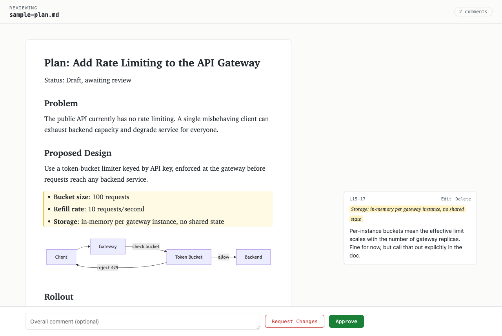

# mdreview

Browser-based review for AI-generated markdown plans. Renders a
markdown file, lets you attach inline comments GitHub-PR-style, and
prints the structured feedback to stdout — so a coding agent can open
a review, wait, and consume the result without any copy-paste.

## Install

    go install github.com/zzn01/mdreview@latest
    mdreview init

`go install` puts the binary in `$(go env GOPATH)/bin` — make sure it
is on your PATH. `mdreview init` installs the embedded `review-plan`
skill to `~/.claude/skills/`, making `/review-plan` available to
Claude Code in every project.

From a clone of this repo, `make install` does both steps.

## Usage

    mdreview docs/plan.md            # opens your browser, blocks until submit
    mdreview --no-open --port 8080 docs/plan.md

On submit the feedback is written to stdout and the process exits 0:

    # Review: REQUEST_CHANGES

    ## Overall
    Tighten the scope.

    ## Comments (1)

    ### 1. L42-48
    > quoted selection from the document
    The cache invalidation here has a race.

Logs and the review URL go to stderr, so `mdreview plan.md > feedback.md`
captures only the feedback.

Raw HTML blocks in the reviewed markdown (e.g. `
`) are not
rendered — goldmark's safe mode omits them, so that markup won't be
visible in the browser.

## Remote review (mobile / another device)

    mdreview --tunnel docs/plan.md

First run downloads `cloudflared` automatically (to a per-user cache
directory; ~40MB, one time) unless it's already on your `PATH`. It then
opens a [Cloudflare quick tunnel](https://developers.cloudflare.com/pages/how-to/quick-tunnel/)
and prints two URLs to stderr:

    mdreview: local:  http://127.0.0.1:PORT/?t=TOKEN
    mdreview: remote: https://random-name.trycloudflare.com/?t=TOKEN

Open the `remote` URL on your phone or any other device on the internet
to review from there; `local` still works on this machine. `--tunnel`
implies `--no-open`: it doesn't launch a local browser, since the point
is reviewing from elsewhere.

Security, plainly:

- The URL and token together are the credential for this review session —
  don't share them with anyone you don't want reading or commenting on the
  document.
- Traffic is TLS from your device to Cloudflare's edge, and TLS from
  Cloudflare's edge to your machine, but it is **not end-to-end
  encrypted** — Cloudflare's edge can see the document in transit. Don't
  tunnel documents too sensitive for that.
- The tunnel is torn down when `mdreview` exits.

## Agent integration (Claude Code)

Run it in the background so the review can take as long as it needs:

1. `mdreview docs/plan.md` via the Bash tool with `run_in_background: true`
2. When the process exits, read its stdout — that is the review.

`make install` places this calling convention at `~/.claude/skills/` as
a user-level `/review-plan` skill; alternatively, run `mdreview init`
(user level) or `mdreview init --project` (this project only).

## Design

See `docs/specs/2026-08-28-mdreview.md`.

## License

MIT — see `LICENSE`.

`ui/mermaid.min.js` is a vendored copy of
[Mermaid](https://github.com/mermaid-js/mermaid) v11.17.2 (MIT, see
`ui/mermaid.min.js.LICENSE`). To upgrade, replace it with
`dist/mermaid.min.js` from a newer release and update the version here.
